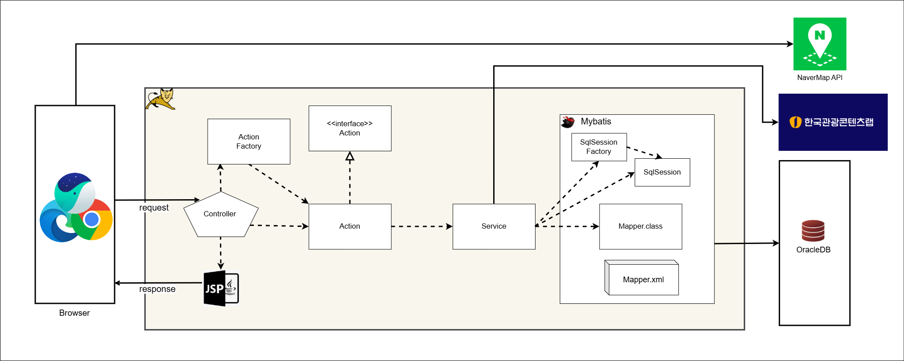
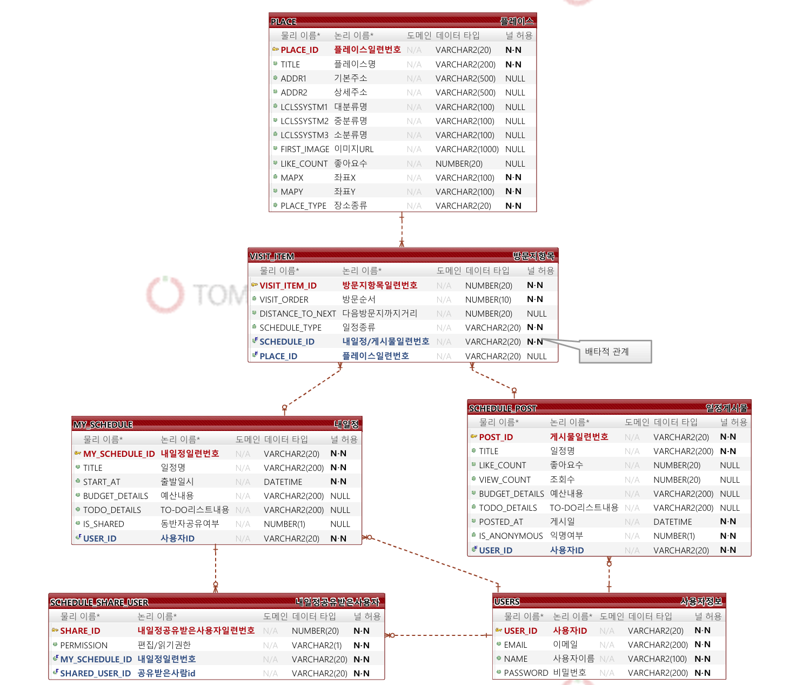

# LetsGo ✈️ — 여행 일정 계획·공유 플랫폼 (1차 스프린트)

> 여행 일정을 만들고 동선·예산·할일을 관리하며, 동반자와 공유하거나 게시판에 공개할 수 있는 웹 서비스.
> **Servlet/JSP 기반 Model2 MVC**로 서비스의 기반 도메인과 핵심 기능을 구축한 1차 스프린트 프로젝트입니다. *(이 구조를 [2차 스프린트](https://github.com/sinee0601/letsgo-2nd)에서 Spring Boot 아키텍처로 리팩토링했습니다.)*

<p>
  
  
  
  
  
  
  
</p>

---

## 📌 프로젝트 개요

| 항목 | 내용 |
|------|------|
| **개발 기간** | 1차 스프린트 · **2025.04.13 ~ 2025.04.30** |
| **개발 형태** | 팀 프로젝트 · 애자일(스프린트) 기반 · GitHub Flow 협업 |
| **진행 방식** | Servlet/JSP 기반 **Model2 MVC**로 도메인·핵심 기능 구현|
| **핵심 목표** | MVC 계층 분리 · Command(Action) 패턴 설계 · JDBC → MyBatis 이관 · 일정 공유/권한 모델링 |

---

## 🏗️ 시스템 아키텍처


> **FrontController + Command(Action) 패턴**의 Model2 MVC 구조입니다.
> 하나의 `FrontControllerServlet`이 모든 요청을 받아, `ActionFactory`가 요청 URI에 맞는 `Action`을 생성·실행하도록 하여 **요청 분기와 비즈니스 처리를 분리**했습니다.

```
[Browser]
   │  HTTP Request (*.do)
   ▼
[FrontControllerServlet]  ──▶  [ActionFactory]  ──▶  [Action / UIAction]
   │  (요청 단일 진입점)           (URI → Action 매핑)         │
   │                                                          ▼
   │                                                     [Service]  ── 트랜잭션·비즈니스 로직
   │                                                          │
   │                                                          ▼
   │                                            [DAO (JDBC) / DAO_MB (MyBatis)]
   │                                                          │
   ▼                                                          ▼
[JSP / HTML View]  ◀── 화면 반환                        [ Oracle / MariaDB ]
       ▲
       └── AjaxServlet + Gson (JSON) ── 비동기 통신
```

| 계층 | 구성 요소 | 역할 |
|------|-----------|------|
| **Controller** | `FrontControllerServlet` · `ActionFactory` | 모든 요청의 단일 진입점, URI 기반 Action 분기 |
| **Command** | `Action`(로직 처리) · `UIAction`(화면 이동) · `AjaxServlet` | 요청 단위 명령 객체, 화면/로직/비동기 응답 분리 |
| **Service** | `~Service` + `~ServiceInterface` | 비즈니스 로직 · 트랜잭션 · 인터페이스 기반 결합도 완화 |
| **Persistence** | `~DAO`(JDBC) · `~DAOMB`(MyBatis) · `DBCP` | 순수 JDBC DAO를 MyBatis DAO로 **점진적 이관** |
| **Model** | `VO` · `DTO` · `Query` | 테이블 매핑 객체, 화면 전송 객체, SQL 상수 분리 |
| **View** | JSP / HTML · `Gson` | 서버 렌더링 화면, AJAX용 JSON 직렬화 |

---

## 🗄️ 데이터베이스 설계 (ERD)



| 테이블 | 설명 |
|--------|------|
| **USERS** | 사용자 정보 (아이디·이메일·이름·비밀번호) |
| **PLACE** | 관광/숙박/음식점 장소 정보 (좌표·분류·좋아요·이미지) |
| **MY_SCHEDULE** | 나의 여행 일정 (일정명·출발일시·예산·할일·공유여부) |
| **VISIT_ITEM** | 일정/게시물에 속한 방문지 항목 (방문순서·다음 방문지까지 거리) — 내일정·게시물과 **배타적 관계** |
| **SCHEDULE_SHARE_USER** | 내일정 공유 대상 사용자 및 편집/읽기 권한 |
| **SCHEDULE_POST** | 공유 게시물 (좋아요·조회수·익명여부·게시일) |

---

## 🧩 주요 기능

| 도메인 | 기능 |
|--------|------|
| 👤 **User** | 회원가입·로그인·로그아웃, 아이디/비밀번호 찾기·변경 (AJAX 중복 검사) |
| 📍 **Place** | 관광·숙박·음식점 카테고리별 탐색, 좋아요 및 좋아요순 정렬, 장바구니(Cart) 담기 |
| 🗓️ **MySchedule** | 여행 일정 생성·조회·삭제, 방문지(동선) 관리, 예산·To-Do 관리 |
| 🤝 **Share** | 동반자 추가 및 편집/읽기 **권한 관리**, 공유받은 일정 조회 |
| 📢 **PostSchedule** | 일정 게시물 작성·상세 조회, 좋아요, 게시물을 내 일정으로 복사 |

---

## 🛠️ 기술 스택

| 구분 | 기술 |
|------|------|
| **Language** | Java 17 |
| **Backend** | Servlet, JSP, Model2 MVC (FrontController + Command Pattern) |
| **Persistence** | JDBC (DBCP), MyBatis 3.2 |
| **View / Async** | JSP, HTML/CSS/JavaScript, Gson (JSON) |
| **Database** | Oracle → MariaDB |
| **Server** | Apache Tomcat |
| **Build / Tool** | Git/GitHub, JUnit |

---

## ✨ 주요 구현 포인트

- **FrontController + Command 패턴** — 단일 진입 서블릿과 `ActionFactory`로 요청 분기를 중앙화하고, 기능 추가 시 `Action` 구현만으로 확장 가능한 구조 설계
- **인터페이스 기반 계층 분리** — `Service`/`DAO`에 인터페이스를 두어 구현 교체가 가능하도록 설계, 이를 활용해 **순수 JDBC DAO → MyBatis DAO로 점진 이관**
- **일정 공유·권한 모델링** — `SCHEDULE_SHARE_USER`로 편집/읽기 권한을 분리하여 공동 편집과 조회 전용 공유를 구분
- **AJAX + Gson 비동기 처리** — 로그인·아이디 찾기·장바구니 담기·좋아요 등을 별도 `AjaxServlet`으로 분리해 부분 갱신 구현
- **SQL 분리 관리** — `Query` 클래스로 SQL을 상수화하여 DAO 로직과 쿼리를 분리

---

## 🚀 실행 방법

```bash
# 1. 저장소 클론
git clone https://github.com/sinee0601/letsgo-1st.git

# 2. Apache Tomcat 서버에 WebContent를 배포 (WAR)
#    - WebContent/WEB-INF/lib 의 라이브러리 포함

# 3. DB 준비
#    - MariaDB_DDL.sql 로 스키마 생성, Dummy.sql 로 초기 데이터 적재
#    - src/config 의 DB 접속 정보(계정/URL) 설정

# 4. Tomcat 실행 후 http://localhost:8080/{context}/ 접속
```

---

## 📂 프로젝트 구조

```
letsgo-1st
├─ src/com/letsgo/place
│  ├─ servlet          # FrontController · ActionFactory · Action / UIAction · AjaxServlet
│  ├─ service          # 비즈니스 로직 + 인터페이스
│  ├─ model
│  │  ├─ dao           # JDBC 기반 DAO + 인터페이스 (DBCP)
│  │  ├─ query         # SQL 상수 분리
│  │  ├─ vo            # 테이블 매핑 객체
│  │  └─ dto           # 화면 전송용 객체
│  ├─ mybatis
│  │  ├─ dao           # MyBatis 기반 DAO (이관)
│  │  └─ service       # MyBatis 서비스
│  └─ util             # 공통 유틸
├─ WebContent          # JSP · HTML · CSS · JS · 라이브러리(WEB-INF/lib)
├─ DDL / MariaDB_DDL.sql / Dummy.sql   # 스키마 · 더미 데이터
└─ ERD.png             # 데이터베이스 설계도
```
